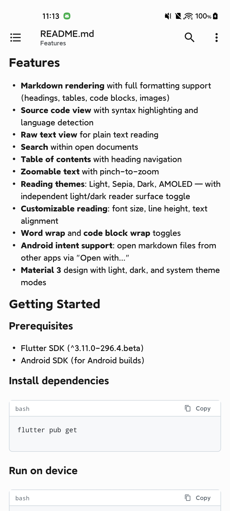
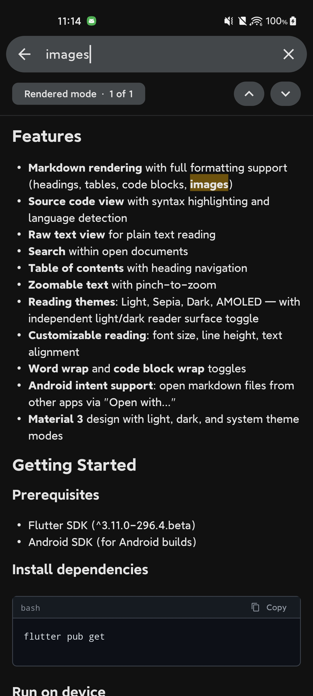

# Markread

A minimal, read-only Markdown reader for Android and web.

Good open-source Markdown readers are hard to find on Android. Existing apps tend to have either poor UI or poor scrolling performance.

[MarkReader](https://github.com/usamaiqb/mark-reader) is one of the few that gets the UI right, but beneath it lies the outdated Markwon library, which holds back its file rendering. This project was born to fill that gap — powered by the much more modern [gpt_markdown](https://pub.dev/packages/gpt_markdown) rendering library, while inheriting MarkReader's polished UI (with a few improvements along the way).

Since this is a Flutter app, the APK size will be larger than [MarkReader](https://github.com/usamaiqb/mark-reader). If you're size-sensitive, stick with the original.

## Features

- **Markdown rendering** with full formatting support (headings, tables, code blocks, images)
- **Source code view** with syntax highlighting and language detection
- **Raw text view** for plain text reading
- **Search** within open documents
- **Table of contents** with heading navigation
- **Zoomable text** with pinch-to-zoom
- **Reading themes**: Light, Sepia, Dark, AMOLED — with independent light/dark reader surface toggle
- **Blue Topaz markdown theme** (light blue-cascade / dark rainbow headings), selectable in Settings
- **Monospace markdown theme** (Typora-style source-like chrome; light + dark), selectable in Settings
- **Customizable reading**: font size, line height, text alignment
- **Word wrap** and **code block wrap** toggles
- **Android intent support**: open markdown files from other apps via "Open with..."
- **Material 3** design with light, dark, and system theme modes

## Screenshots

<p align="center">
  
  &nbsp;&nbsp;
  
</p>

<p align="center">
  <em>Light</em>
  &nbsp;&nbsp;&nbsp;&nbsp;&nbsp;&nbsp;&nbsp;&nbsp;&nbsp;&nbsp;&nbsp;&nbsp;&nbsp;&nbsp;&nbsp;&nbsp;&nbsp;&nbsp;&nbsp;&nbsp;&nbsp;&nbsp;&nbsp;&nbsp;&nbsp;&nbsp;&nbsp;&nbsp;&nbsp;&nbsp;&nbsp;&nbsp;&nbsp;&nbsp;&nbsp;&nbsp;&nbsp;&nbsp;&nbsp;&nbsp;&nbsp;&nbsp;&nbsp;&nbsp;&nbsp;&nbsp;&nbsp;&nbsp;&nbsp;&nbsp;&nbsp;&nbsp;&nbsp;&nbsp;
  <em>Dark</em>
</p>

## Getting Started

### Prerequisites

- Flutter SDK (^3.11.0-296.4.beta)
- Android SDK (for Android builds)

### Install dependencies

```bash
flutter pub get
```

### Run on device

```bash
# List available devices
flutter devices

# Run on a connected Android device
flutter run -d <device-id>

# Run on web
flutter run -d chrome
```

### Build

```bash
# Android debug APK
flutter build apk --debug

# Android release APK (arm64 only, minified — ~20 MB)
flutter build apk --release --target-platform android-arm64

# Full release (APK + AAB, with analysis)
./release.sh

# Web
flutter build web
```

## Architecture

- **State management**: Riverpod 3.x (`Notifier`/`AsyncNotifier` pattern, no code generation)
- **Navigation**: GoRouter with route parameters
- **Markdown rendering**: `gpt_markdown` 1.1.7
- **Design**: Material 3 with `ColorScheme` manual configuration

```
lib/
├── main.dart                    # Entry point
├── app.dart                     # App widget, router, theme setup
├── core/
│   ├── models/                  # Data models (UserPreferences, etc.)
│   ├── providers/               # Shared providers (preferences)
│   ├── services/                # File I/O, intent handling
│   └── theme/                   # Light/dark theme definitions
└── features/
    ├── home/                    # Home screen with file picker
    ├── viewer/                  # Markdown/Source/Raw viewer
    │   ├── screens/
    │   ├── providers/
    │   └── widgets/             # MarkdownView, SourceCodeView, SearchBar, TOC, Zoom
    └── settings/                # Appearance and reading preferences
```

## Credits

The original Android version of this app: [mark-reader](https://github.com/usamaiqb/mark-reader) by [usamaiqb](https://github.com/usamaiqb).

Markdown theme **Blue Topaz** is adapted from [typora-blue-topaz-theme](https://github.com/qishaoyumu/typora-blue-topaz-theme) by [qishaoyumu](https://github.com/qishaoyumu) (MIT; upstream Obsidian Blue Topaz by whyt-byte).

Markdown theme **Monospace** is adapted from [typora-monospace-theme](https://github.com/typora/typora-monospace-theme) by [typora](https://github.com/typora) (MIT).

## License

MIT
